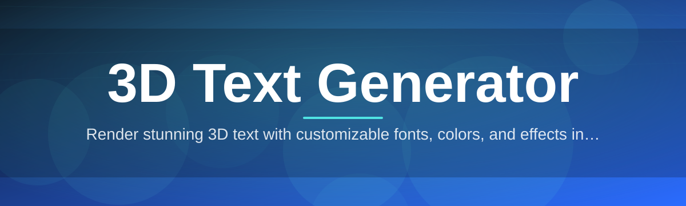

# 3d-text-editor

Render stunning 3D text with customizable fonts, colors, and effects in real time

  

## Overview

Render stunning 3D text with customizable fonts, colors, and effects in real time

## License

[MIT License](LICENSE)
